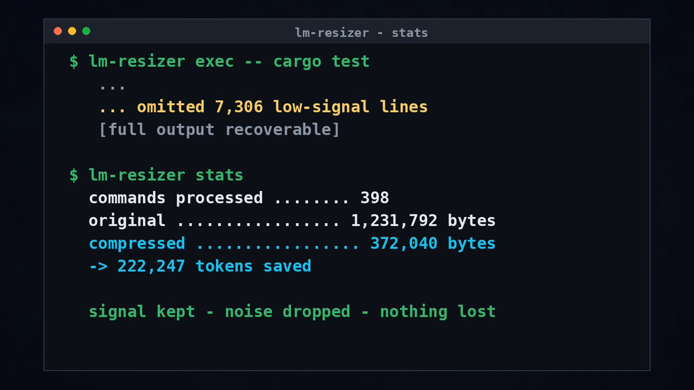
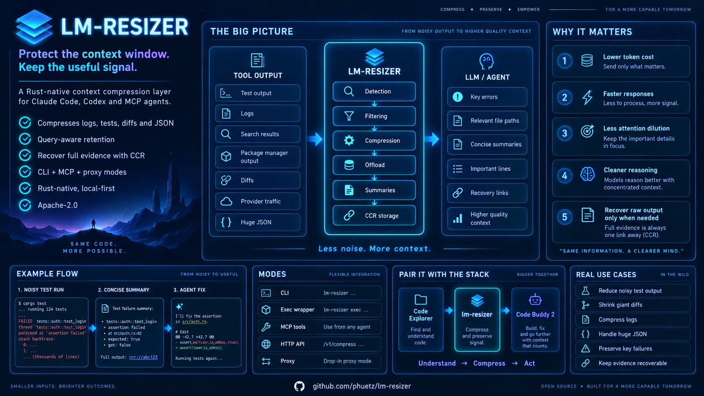
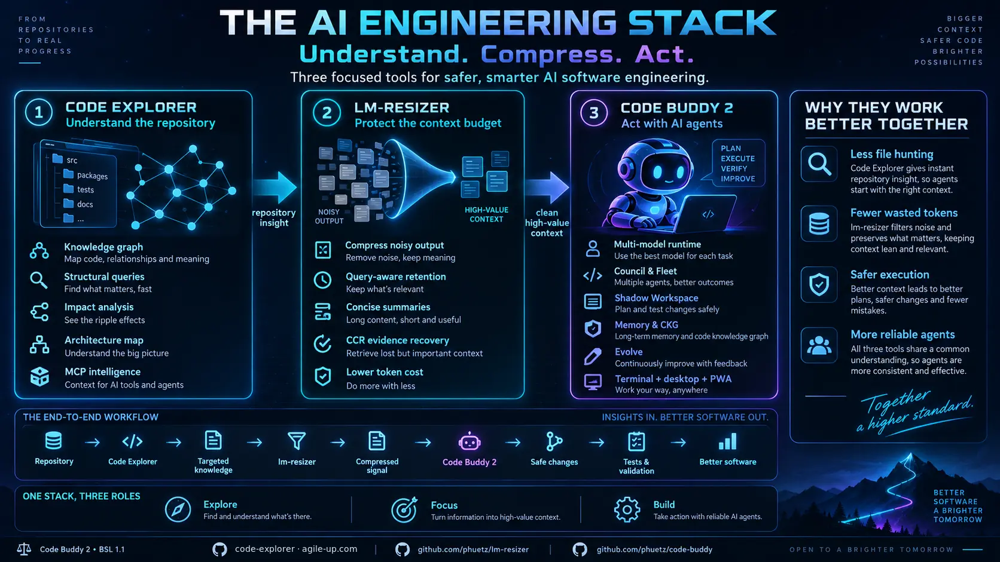

# lm-resizer

Make **Claude Code** and **Codex** work with less noise, fewer wasted tokens,
and more useful context.



> One `cargo test` run through `lm-resizer`: **398 commands, 1.23 MB → 372 KB,
> 222,247 tokens saved** — signal kept, noise dropped, nothing lost (full output
> stays recoverable).



Website: <https://phuetz.github.io/lm-resizer/>

French README: [README.fr.md](README.fr.md)

`lm-resizer` is designed for a practical agent problem: Claude Code, Codex, and
MCP agents spend a surprising amount of their context window on raw tool output.
Its purpose is simple: **save tokens and preserve useful context by removing,
compressing, or offloading data the model does not need to reason well**.

When an agent runs commands such as `cargo test`, `npm test`, `git diff`, `rg`,
linters, package managers, or provider/API calls, the raw output often contains
thousands of repeated, low-value, or structurally noisy lines. Sending all of
that to the LLM wastes tokens, fills the context window, and can hide the real
error. `lm-resizer` filters and compresses that output before it reaches the
agent, while keeping important failures, file paths, summaries, and recovery
links visible.

**Why this matters even with large context windows.** Bigger windows (200K, 1M+)
don't make noisy output free — they make it *expensive in three ways*: **cost**
(you pay per token, every turn), **latency** (more tokens = slower responses),
and **attention dilution** — models reason worse when the signal is buried in
noise ("lost in the middle"). `lm-resizer` is about **signal density**, not
fitting under a size limit: keep what the agent needs to reason, drop the rest,
keep the full output recoverable. It can also compress **query-aware** — biasing
retention toward the rows relevant to the user's current question when it must
drop anything.

**Provider-agnostic, validated live.** lm-resizer sits in front of any
OpenAI/Anthropic-compatible API. Verified end-to-end (2026-06-23) in front of
**Mistral, Ollama (local, `$0`), DeepSeek, OpenRouter and xAI/Grok** — real keys:
a request is compressed by the proxy and the upstream model answers through it
(for Mistral, a noisy tool payload shrank ~5.8KB→2.8KB then the model replied).
Any other OpenAI/Anthropic-compatible provider works via the same path.

## Why this exists

`lm-resizer` is part of a broader toolchain for making coding agents usable on
large real-world repositories:

- **Code Explorer** gives the agent a queryable map of the codebase.
- **lm-resizer** protects the agent from wasting context on noisy execution
  output.
- **Code Buddy** orchestrates the coding workflow.

The goal is not just compression. The goal is a cleaner, easier-to-explain way
to work with Claude Code and Codex: give the agent structure, remove low-value
noise, and keep the full evidence recoverable when needed.

Use it as a context-budget layer for agent workflows:

- **Claude Code and Codex hooks**: capture noisy tool output after commands run
  and record compressed savings data.
- **`lm-resizer exec`**: wrap commands so agents receive filtered output instead
  of raw logs.
- **MCP tools**: expose compression, retrieval, and stats to compatible agents.
- **HTTP/proxy mode**: compress OpenAI/Anthropic-compatible provider payloads
  before previewing or forwarding them.
- **CCR recovery**: offload bulky data locally and retrieve the original output
  when the agent really needs the full evidence.

## Pair it with Code Explorer



`lm-resizer` is complementary to
[Code Explorer](https://github.com/phuetz/code-explorer). Code Explorer gives
Claude Code, Codex, and MCP agents a queryable map of the repository: files,
symbols, calls, dependencies, and change impact. `lm-resizer` protects the
agent's context budget while it works by compressing noisy command output,
logs, diffs, search results, JSON payloads, and provider traffic.

Used together, Code Explorer helps the agent know **where to look**, while
`lm-resizer` keeps the agent from wasting tokens on low-value output after it
starts running commands. The result is a cleaner loop: structural questions go
to the code graph, noisy execution output goes through compression, and the full
raw evidence remains recoverable through CCR when needed.

This repository is a standalone Rust-only context compression engine. It keeps the
useful primitives local and dependency-light at runtime:

- content detection
- JSON minification
- JSON array SmartCrusher offload
- query-aware row retention (bias what survives toward the user's question)
- log template compression
- log offload
- diff offload
- diff-noise offload
- conservative source-code compression
- CCR storage in SQLite
- minimal MCP stdio server
- small HTTP API

No telemetry collector, dashboard, or tracing subscriber is enabled by the
binary. Commands emit only their requested result payloads.

There is no Python runtime, Python package manifest, or versioned Python helper
script in this repository. Build, test, MCP, CLI, and proxy surfaces are Cargo
and Rust binaries only.

ML-backed content classification is **opt-in and off by default**. The normal
path uses deterministic local detection (no ONNX runtime, no model). To enable
real ONNX classification, build with the `magika` feature **and** set
`LM_RESIZER_ENABLE_MAGIKA=1` at runtime:

```bash
cargo build --release --features magika
LM_RESIZER_ENABLE_MAGIKA=1 lm-resizer ml-status   # -> "active (ort runtime, bundled Magika model)"
```

This uses Google's official [`magika`](https://crates.io/crates/magika) crate
(bundled `standard_v3_3` model, Apache-2.0). Without the build feature the flag
is a no-op and detection stays deterministic; on any model/runtime error the
ONNX path falls back to deterministic detection. ONNX detection is native-only
(it is never compiled into the wasm build).

## Build

```bash
cargo build
```

Release checks and local packaging:

```bash
./scripts/check-release.sh
./scripts/package-release.sh
# Windows:
powershell -File scripts/check-release.ps1
powershell -File scripts/package-release.ps1
powershell -File scripts/check-wasm-package.ps1
powershell -File scripts/release-evidence.ps1
powershell -File scripts/generate-checksums.ps1
powershell -File scripts/smoke-proxy-preview.ps1
powershell -File scripts/check-publish-readiness.ps1
powershell -File scripts/publish-wasm.ps1 -DryRun
powershell -File scripts/publish-wasm.ps1  # requires NPM_TOKEN or npm login
```

`package-release` includes the binary, current docs, examples, provider fixtures,
the WASM wrapper package, `release-evidence.json`, and `SHA256SUMS`.
Use [docs/RELEASE.md](docs/RELEASE.md) as the approval checklist before running
the real npm publish command.

GitHub Actions CI runs the same release checks on Linux and Windows, then uploads
`release-evidence.json`, the WASM npm tarball, and the platform archive.
The `Publish WASM Package` workflow performs the real npm publish through the
`npm-production` environment using npm trusted publishing/OIDC, with `NPM_TOKEN`
available as a fallback.
`scripts/check-publish-readiness.*` validates the local publish workflow,
package metadata, release evidence, and remaining external approval
requirements before maintainers run the protected workflow.
Use `scripts/sign-windows-release.ps1` only when a real code-signing
certificate is available; it is intentionally not part of normal CI.

Contribution and security workflows are documented in
[CONTRIBUTING.md](CONTRIBUTING.md) and [SECURITY.md](SECURITY.md). GitHub issue
templates are provided for sanitized provider fixtures and reusable command
filters, and Dependabot is configured for Cargo, npm, and GitHub Actions.

## CLI

```bash
lm-resizer compress --input tool-output.txt --json
type tool-output.txt | lm-resizer compress --json
lm-resizer batch logs/ --recursive --ext log,json,diff --jobs 8 --json
lm-resizer exec -- git status
lm-resizer exec --json -- cargo test
lm-resizer exec --stream -- cargo test
command-that-is-already-sandboxed | lm-resizer tool-output --command "cargo test" --token-budget 2000 --json
lm-resizer rewrite -- git status
lm-resizer rewrite-shell "cargo test && git status"
lm-resizer trust-filters --path .lm-resizer/filters.toml
lm-resizer list-trusted-filters --json
lm-resizer audit-filters --path .lm-resizer/filters.toml
lm-resizer untrust-filters --path .lm-resizer/filters.toml
lm-resizer verify-filters --path .lm-resizer/filters.toml --json
lm-resizer init-filters --path .lm-resizer/filters.toml
lm-resizer init-filters --profile rust --path .lm-resizer/filters.toml --force
lm-resizer audit-filters --path .lm-resizer/filters.toml --review
lm-resizer sanitize-provider-fixture --provider openai --input payload.json --output fixtures/provider-cache/openai-real.json
lm-resizer discover ~/.claude/projects --recursive --json
lm-resizer discover ~/.claude/projects --recursive --markdown
lm-resizer discover-sessions --agent all --markdown
lm-resizer eval fixtures/sessions --recursive --markdown
lm-resizer learn ~/.claude/projects --recursive --write --markdown
lm-resizer learn ~/.claude/projects --recursive --install --client all
lm-resizer init-hooks --project-dir . --force
lm-resizer init-native-hooks --client all --project-dir . --force
lm-resizer init-shims --project-dir . --force
lm-resizer install-hooks --client codex --project-dir . --force
lm-resizer uninstall-hooks --client codex --project-dir .
lm-resizer retrieve <ccr-hash>
lm-resizer stats
lm-resizer stats --markdown
lm-resizer image screenshot.png --json
lm-resizer voice --input transcript.txt --clean
lm-resizer ml-status --json
lm-resizer tee list --json
lm-resizer tee read <tee-file-name>
lm-resizer tee purge --all
lm-resizer doctor --json
lm-resizer serve --dashboard
```

`exec` runs a command, applies RTK-inspired output filtering for noisy command
families such as `git`, `cargo`, `rg`, `vitest`/`jest` (directly or via
npx/pnpm/yarn/bunx), and directory listings, then sends the filtered text
through the normal compression pipeline. It is an explicit CLI wrapper, not an
automatic shell hook. The test-runner filter keeps failing files/tests,
assertion diffs, stack frames and the final counters; a passing run collapses
to just the summary lines — in agent telemetry, test-runner output is the
single biggest token sink.
Use `--stream` for long-running commands when you still want live child output;
lm-resizer captures the stream and emits the filtered/compressed result after
the child exits.

`tool-output` is the agent-native counterpart to `exec`: it **never executes
the command**. A host such as Code Buddy can validate, approve and run a command
inside its own sandbox, then pipe the inert output to `tool-output`. lm-resizer
uses `--command` only to select the same semantic filter as `exec`, applies the
optional query-aware `--token-budget`, stores the complete original under a CCR
recovery hash, and returns the exact original whenever the candidate would not
meet `--min-savings-bytes` and `--min-savings-ratio`. The recovery write is
verified before the hash is announced; if the configured CCR backend cannot
read the original back, lm-resizer returns the exact raw output. Use
`--request-json` to pass the complete request over stdin so commands and user
queries do not appear in the process argument list. This avoids wrapper
binaries inside the sandbox and guarantees that compression never makes a tool
result larger.

Both `compress` and `exec` accept `--token-budget`. Use a model-aware budget
when the caller knows the remaining context capacity; omit it for the
lossless-first pipeline.

`rewrite` is the safe hook-building primitive: it does not execute anything, it
only reports whether a command is supported and prints the equivalent
`lm-resizer exec -- ...` invocation.

`rewrite-shell` applies the same idea to a full shell line. It may rewrite
independent segments joined by `&&`, `||`, or `;`, but leaves any expression
containing a pipeline or redirection untouched so filtering cannot change a
consumer's input or a file's contents.

`exec` also supports lightweight declarative filters. Put project filters in
`.lm-resizer/filters.toml`, then run `lm-resizer trust-filters` to approve the
current file hash. You can also point `LM_RESIZER_FILTERS` at a TOML file.
Built-in TOML filters currently cover Terraform/OpenTofu plan output,
Docker/Podman process listings, `systemctl status`, package install logs,
Homebrew install/upgrade logs, `make`, GitHub CLI, Go, .NET, Python linters,
JVM builds, Python package managers, JS quality tools, Docker logs, Kubernetes,
and AWS CLI. Set
`LM_RESIZER_NO_TOML_FILTERS=1` to disable this layer, or
`LM_RESIZER_TRUST_PROJECT_FILTERS=1` to bypass project-filter trust checks.
Use `verify-filters` to validate syntax, reject unknown TOML fields, report
schema diagnostics, and run inline `[[tests]]` cases before trusting a filter
file; `trust-filters` refuses files whose inline tests fail.
Use `audit-filters`, `list-trusted-filters`, and `untrust-filters` to inspect or
revoke local filter approvals.
Use `audit-filters --review` to generate a Markdown approval packet showing the
trust status, inline test results, diagnostics, filter actions, and exact
commands to run before trusting a changed filter file.
Use `init-filters` to create a starter project filter file with inline tests;
profiles are available for `generic`, `rust`, `node`, `python`, and `infra`.

`sanitize-provider-fixture` turns real provider JSON into a shareable fixture by
redacting secret-like fields and replacing long strings with placeholders.

When command output is large or the child command fails, `exec` stores the raw
output under the lm-resizer state directory and appends a `[full output: ...]`
hint. Set `LM_RESIZER_TEE=0` to disable raw-output recovery. `exec` records a
small JSONL history for savings stats; set `LM_RESIZER_TRACKING=0` to disable it.
Use `tee list`, `tee read`, and `tee purge` to manage saved raw outputs.

`discover` scans JSON/JSONL/log/text files for command/output pairs and estimates
what `lm-resizer exec` would have saved. It includes Claude/Codex-style tool
message extraction, does not execute commands, and can emit Markdown for
documentation or social posts.
Use `discover-sessions` to scan known Claude/Codex session locations without
manually passing their paths.

`eval` is a lightweight harness over the same session/log fixtures. It emits a
stable pass/warn report with command-output counts, candidates, and estimated
savings for CI or release notes.

`retrieve` and `GET /retrieve/:hash` record lightweight local retrieval feedback
in the lm-resizer state directory unless `LM_RESIZER_TRACKING=0` is set. `stats`
includes aggregate retrieval counts so you can see whether CCR offloads are
actually being read back.

`learn` builds on `discover` plus local `exec` history. It writes durable memory
under `.lm-resizer/learning`, emits Markdown recommendations, and can install a
separate reversible learned-guidance block into `AGENTS.md`, `CLAUDE.md`, or
both. The learned block is distinct from the hook block so it can be refreshed
after long Claude/Codex sessions without touching hook setup.

`init-hooks` writes opt-in helper scripts and an `AGENT_RULES.md` snippet under
`.lm-resizer/hooks`. These helpers call `rewrite` / `rewrite-shell`; they do not
execute target commands or modify agent config.

`init-native-hooks` writes real Claude Code / Codex hook config
(`.claude/settings.json` / `.codex/hooks.json`) wiring two events: a
**PreToolUse rewrite** that substitutes a supported Bash command with
`lm-resizer exec -- <cmd>` in place (the model then sees the filtered,
compressed output — the active rtk role), and a **PostToolUse** handler that
records command-output savings telemetry. The rewrite never blocks: an
unsupported or unparseable command emits nothing and runs raw, and the hook
refuses to re-wrap its own `exec` invocations.

`init-shims` writes opt-in PATH shims under `.lm-resizer/shims`. Put that
directory at the front of `PATH` for a shell/session to automatically route
known noisy commands through `lm-resizer exec -- <original-command>`. Shims
capture the original executable path when generated, so they do not recurse
through themselves.

`install-hooks` adds a marked, reversible instruction block to `AGENTS.md`
(Codex), `CLAUDE.md` (Claude), or both. `uninstall-hooks` removes only that
marked lm-resizer block.

The default CCR store is:

- Windows: `%LOCALAPPDATA%\lm-resizer\ccr.sqlite3`
- Linux/macOS: `$XDG_STATE_HOME/lm-resizer/ccr.sqlite3` or `$HOME/lm-resizer/ccr.sqlite3`

Override it with `--store <path>` or `LM_RESIZER_STORE`.
Override the state directory for tee/history files with `LM_RESIZER_STATE_DIR`.

`serve --dashboard` enables a local `/dashboard` HTML view over the existing
store and `exec` history counters. It is disabled by default and does not start
a telemetry collector.

`image`, `voice`, and `ml-status` cover local media/ML decision support without
adding runtime model dependencies: image inspects size/dimensions, voice removes
common transcript filler tokens, and ml-status reports whether optional Magika /
ONNX classification is enabled.

## Skills for Claude Code and Codex

Two drop-in skills teach an agent *when* to wrap a command, how to recover the
raw output, and how to report what it saved — no hook or MCP server required:

```bash
# Claude Code (project-scoped, or ~/.claude/skills for every project)
cp -r .claude/skills/lm-resizer /path/to/your/repo/.claude/skills/
# Codex
cp -r .codex/skills/lm-resizer ~/.codex/skills/
```

The skill only ever runs `lm-resizer exec --raw-on-failure -- <command>`: a
failing command is shown raw, a passing one is summarised, and every raw output
stays under `lm-resizer tee list`. Pair it with the
[Code Explorer](https://github.com/phuetz/code-explorer) skill: map first, then
filter.

## MCP

```bash
lm-resizer mcp
lm-resizer install --client claude --scope project
lm-resizer install --client codex --scope global
lm-resizer install --client all --scope project
lm-resizer install --client all --scope project --project-dir /path/to/repo
lm-resizer wrap --timeout-sec 10 codex -- --version
lm-resizer wrap cursor -- --help
```

Tools exposed:

- `lm_resizer_compress`
- `lm_resizer_tool_output` (post-execution command-aware reduction; never executes commands)
- `lm_resizer_retrieve`
- `lm_resizer_stats`

## Rust API

```rust
use lm_resizer_core::LmResizer;

let resizer = LmResizer::new();
let report = resizer.compress(tool_output, "current task");
println!("{}", report.output);
```

`LmResizer` uses the same default compression pipeline as the CLI and returns a
stable `CompressionReport` with byte counts, applied steps, CCR keys, and the
compressed output. See [docs/API.md](docs/API.md) and the compilable
[`examples/basic.rs`](examples/basic.rs) /
[`examples/persistent_store.rs`](examples/persistent_store.rs) samples.

## C / WASM ABI

`lm-resizer-core` builds `rlib`, `cdylib`, and `staticlib` artifacts. The
minimal exported ABI is:

- `lm_resizer_compress_json(content_ptr, content_len, query_ptr, query_len)`
- `lm_resizer_string_free(ptr)`
- `lm_resizer_alloc(len)`
- `lm_resizer_free(ptr, len)`

`lm_resizer_compress_json` returns a null-terminated JSON `CompressionReport`
or `{ "error": "..." }`. Both the native C ABI and the WASM build run the **full
default pipeline** (JSON SmartCrusher, log/diff/source compression, CCR offload)
— the same one the CLI uses, not a reduced minifier. See [docs/ABI.md](docs/ABI.md).
The C header is [include/lm_resizer.h](include/lm_resizer.h). The npm-style
WASM wrapper is under [packages/wasm](packages/wasm); build the `.wasm` artifact
with `scripts/build-wasm.sh` / `scripts/build-wasm.ps1` and a local npm tarball
with `scripts/package-wasm.sh` / `scripts/package-wasm.ps1`. Publish it with
`scripts/publish-wasm.sh` / `scripts/publish-wasm.ps1` after setting
`NPM_TOKEN` or running `npm login`.

## HTTP

```bash
lm-resizer serve --bind 127.0.0.1:8787
```

Endpoints:

- `GET /health`
- `POST /compress` with `{ "content": "...", "query": "optional" }`
- `POST /tool-output` with `{ "content": "...", "command": "cargo test", "query": "optional", "token_budget": 2000 }`
- `GET /retrieve/:hash`
- `GET /stats`
- `POST /v1/chat/completions`
- `POST /v1/responses`
- `POST /v1/messages`
- `POST /model/:model_id/invoke`
- `POST /model/:model_id/invoke-with-response-stream`
- `POST /v1/projects/:project/locations/:location/publishers/:publisher/models/*model_method`
- `POST /v1beta/projects/:project/locations/:location/publishers/:publisher/models/*model_method`

The `/v1/*` routes use **provider-aware live-zone compression**: the
OpenAI chat/responses and Anthropic messages routes are compressed by the
dedicated dispatchers in `lm-resizer-core::transforms::live_zone`, which target
the latest tool/user blocks and preserve provider cache markers (rather than the
generic field walk used for other routes). With `--upstream <base-url>` or
`LM_RESIZER_UPSTREAM`, the compressed request is forwarded to the upstream
provider. Without an upstream, the server returns a preview containing the
compressed request and compression stats.
Bedrock and Vertex route shapes are also accepted for preview/forwarding. Use
`--provider bedrock` with `AWS_ACCESS_KEY_ID`, `AWS_SECRET_ACCESS_KEY`,
optional `AWS_SESSION_TOKEN`, and `AWS_REGION` / `AWS_DEFAULT_REGION` for
SigV4-signed Bedrock requests. The Bedrock provider also reads
`AWS_PROFILE`, `AWS_SHARED_CREDENTIALS_FILE`, `AWS_CONFIG_FILE`, and EC2 IMDSv2
role credentials. If AWS credentials are not present, `LM_RESIZER_API_KEY` is
passed as an `Authorization` header. Use `--provider vertex` with
`LM_RESIZER_GOOGLE_ACCESS_TOKEN`, `GOOGLE_OAUTH_ACCESS_TOKEN`,
`GOOGLE_APPLICATION_CREDENTIALS` service-account JSON, or GCE metadata-server
credentials; explicit `LM_RESIZER_API_KEY` is passed as a bearer token.
The release check runs `scripts/smoke-proxy-preview.*`, which starts the local
proxy, posts an OpenAI-compatible chat request without an upstream, and verifies
the compressed preview envelope.

## Implementation Status

Done in Rust:

- compression pipeline and CCR store
- SmartCrusher-backed JSON offload
- log/diff/search/source compression primitives present in the core
- CLI, MCP installer, RTK-inspired command output wrapper, agent wrapper
  launcher, and HTTP/proxy surfaces
- RTK-inspired TOML filters, raw-output recovery hints, and exec savings history
- trusted project filters and offline discover audits for session logs
- generated hook helper scripts for future Claude/Codex integrations
- opt-in `AGENTS.md` / `CLAUDE.md` hook instruction installer
- opt-in PATH command shims for automatic shell rewriting
- broader built-in filters including Go, .NET, JVM, Python package managers,
  Kubernetes, AWS, and JS quality tools
- vitest/jest test-runner filter (direct or via npx/pnpm/yarn/bunx) — the
  largest agent token sink in measured telemetry
- streaming `exec --stream` capture for long-running commands
- Bedrock and Vertex proxy route shapes for compressed preview/forwarding
- OpenAI-compatible `/v1/*` POST fallback and SSE preview for streaming requests
- WebSocket preview handling for `/v1/*` realtime-style paths
- bidirectional upstream WebSocket bridging for `/v1/*` when `--upstream` is set
- gzip/deflate request and response decompression in proxy preview/forwarding
- non-JSON `/v1/*` upload preview/forwarding without compression
- provider-aware live-zone compression wired into the proxy for the OpenAI
  chat/responses and Anthropic messages routes (generic field-walk fallback for
  other routes)
- high-level Rust API via `LmResizer`
- minimal C/WASM ABI for non-Rust hosts — the WASM build runs the full default
  pipeline (not a reduced minifier)
- public C header and prebuilt npm-style WASM wrapper package artifact
- npm publish scripts for the WASM package, gated by `NPM_TOKEN` / `npm login`
- npm publish dry-run scripts for approval checks without credentials
- local WASM/npm package preflight that validates wrapper syntax and package
  contents without publishing
- release evidence manifest under `dist/release-evidence.json`
- provider cache fixture JSON under `fixtures/provider-cache` for OpenAI,
  Anthropic, Bedrock, and Vertex envelope regression tests
- local setup diagnostics with `doctor`
- `learn` workflow for cross-agent recommendations and durable agent guidance
- local CCR retrieval feedback included in `stats`
- opt-in local `/dashboard` view over existing counters, with no background
  telemetry collector
- native Codex/Claude hook config generation plus a non-blocking Rust hook
  handler: PreToolUse command rewrite (in-place output substitution through
  `exec`, verbatim command preservation) and PostToolUse savings records
- local image inspection, transcript filler cleanup, and ML classifier status
- optional ONNX content detection via Google's `magika` crate (opt-in
  `--features magika` + `LM_RESIZER_ENABLE_MAGIKA=1`; bundled `standard_v3_3`
  model, deterministic fallback)
- lightweight `eval` harness over session/log fixtures
- direct proxy launcher env mapping for Claude Code, Codex, Cursor, OpenCode,
  OpenClaw, Aider, and Copilot
- host-safe post-execution `tool-output` integration over CLI, MCP and HTTP,
  including semantic command filters, model-aware token budgets, full-original
  CCR recovery, and a strict no-growth acceptance gate

Not yet implemented:

- external npm registry credentials and release approval
- project-specific/custom ecosystem filters beyond the built-ins and starter
  contribution templates
- deeper agent-native integrations beyond the current PreToolUse rewrite +
  PostToolUse telemetry hooks (e.g. session-level context surfaces)

Detailed port tracker: [docs/PORTING.md](docs/PORTING.md).
Claude/Codex usage guide: [docs/CLAUDE_CODEX.md](docs/CLAUDE_CODEX.md).
Social post drafts: [docs/SOCIAL_POSTS.md](docs/SOCIAL_POSTS.md).
