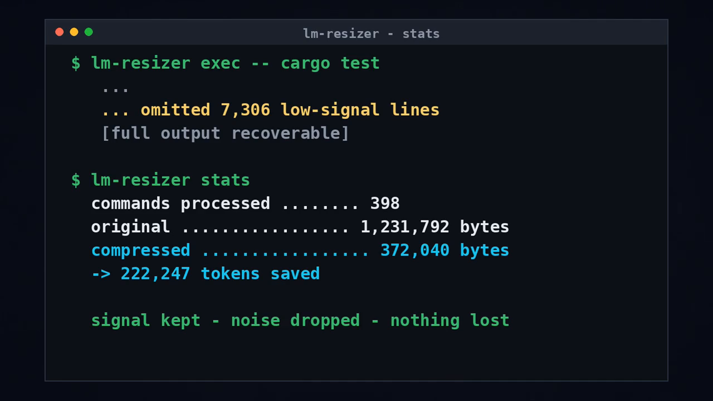

# LM Resizer

**Shorten noisy command output before it reaches your coding agent — and never lose a failure.** LM Resizer is a fast, local Rust CLI for developers who drive tests, builds, Git, containers and other tools through an AI coding agent such as Claude Code, Codex, Cursor, Gemini CLI, an MCP client or a custom pipeline. It runs a command, keeps a compact result for the agent, and stores the byte-exact original for instant recall.

On a benchmark of 61 command captures it saves a median **21.32%** of tokens with the raw recovery included, keeps the producer's exit code in **61/61** cases and starts in about **8 ms**. Zero telemetry, 100% local, deterministic.

[Français](README.fr.md) · [Comparison benchmark](bench/native/README.md)

## Install

Prebuilt binary for Linux and macOS:

~~~sh
curl -fsSL https://raw.githubusercontent.com/phuetz/lm-resizer/v0.2.6/install.sh -o install.sh && sh install.sh
export PATH="$HOME/.local/bin:$PATH"
lm-resizer --version
~~~

Windows PowerShell:

~~~powershell
irm https://raw.githubusercontent.com/phuetz/lm-resizer/v0.2.6/install.ps1 | iex
~~~

The installer verifies the archive's SHA-256 checksum and binary version before placing `lm-resizer` in `~/.local/bin` by default. Prepared platforms are Linux x86_64, macOS x86_64/arm64 and Windows x86_64. The existing v0.2.2 release has no prebuilt archives.

On Linux and macOS the installer prints the line to add when `~/.local/bin` is not on your `PATH`; to make it permanent in Bash, run `echo 'export PATH="$HOME/.local/bin:$PATH"' >> ~/.bashrc` (use `~/.zshrc` for zsh) and open a new terminal. The Windows installer updates the user `PATH`. `LM_RESIZER_INSTALL_DIR` selects another destination. To uninstall a prebuilt binary, remove it from that destination. [Windows: TLS fallback, PowerShell 5.1 and byte-exact recovery](docs/WINDOWS.md).

## See it work

`tool-output` filters output that a host already captured. The reduced view keeps the failing test and points to the exact original:

~~~console
$ lm-resizer tool-output --command 'cargo test' --input bench/corpus/cargo_fail.txt
FAILURES (1):
1. ---- parse::reject_empty stdout ----
thread 'parse::reject_empty' panicked at src/parser.rs:42:9:
assertion `left == right` failed: expected=422 observed=200

test result: FAILED. 70 passed; 1 failed; finished in 0.09s
[tee:78bf04f25902] lm-resizer tee read 78bf04f25902
~~~

The same command run on the 78-line file reports **792** original tokens and **80** compressed tokens. Four bundled captures, measured on this machine with `o200k_base`:

| Capture (`bench/corpus/`) | `--command` | Original | Compressed |
|---|---|---:|---:|
| `cargo_ok.txt` | `cargo test` | 837 | 24 |
| `cargo_fail.txt` | `cargo test` | 792 | 80 |
| `pytest_ok.txt` | `pytest` | 937 | 17 |
| `git_log.txt` | `git log` | 2320 | 2320 |

Reproduce any row with `lm-resizer tool-output --command '<command>' --input <file> --json`: the JSON reports `original_tokens`, `compressed_tokens` and `tokens_saved` with `token_count_method: "exact"`. `git_log.txt` comes back unchanged: the `git log` view shows every commit, and on this history that saves no token, so the raw text is kept.

## Why LM Resizer? (compared with a reference CLI filter and Headroom)

Two other tools are commonly used to shrink command output: a command-output filter (the pinned reference, named in [the benchmark](bench/native/README.md)) and Headroom. Their own published numbers are reproduced in [`bench/native/windows-release/delivery.md`](bench/native/windows-release/delivery.md) on the same 61 captures, tokenized with `o200k_base`, raw recovery included:

| 61 command captures, `o200k_base` | LM Resizer 0.2.6 | Reference CLI filter, pinned | Headroom 0.39.1, general API |
|---|---:|---:|---:|
| Median tokens saved, raw recovery included | 21.32% | 15.81% | 0.00% |
| Mean tokens saved, raw recovery included | 28.97% | 32.61% | 1.91% |
| Producer exit code preserved | 61/61 | 52/61 | not measured |
| Byte-exact raw recoverable | 61/61 | partial or none | no |

LM Resizer's replayed median (21.32%) exceeds the reference filter's (15.81%) on this corpus, but its mean (28.97%) is below the reference filter's (32.61%): since 0.2.6 the `git log` view shows every commit, where the reference filter still shows only the first (five captures that counted 91-97% saved now count 0-38%). Long patches retain the opening diagnostic window and keep the complete original in tee; test assertions and compiler diagnostics stay intact. The reference filter returns exit code 0 in **9** of the 61 captures where the producer failed; LM Resizer keeps the producer's code. On one capture LM Resizer returns 251 tokens against the reference filter's 40 because it states the **457** collection errors and lists the first ten failing files, which it omits. Headroom compresses LLM API context semantically and has no dedicated CLI tool filters, so its median saving on this command corpus is 0.00%. Strict view equality is 38/61; the twenty-three differences and their reasons are listed in the benchmark file, and the benchmark's strict checker exits 1 by design. The numbers are replayed in one step with `bench/real/rejouer.sh` (isolated Python with tiktoken, comparison executable built from the pinned archive, replay in a fresh directory, summary of medians, recoveries and exit codes; network needed the first time, `--sans-headroom` skips the Headroom column); the benchmark's Python script alone needs its arguments, see [the benchmark](bench/native/README.md).

## Try it on your project

`exec` runs a command, gives the agent the shortened view and keeps the original. The examples below assume the wrapped tools are present: `git` and a current directory inside a Git repository (outside one, Git itself fails with exit 128 and there is nothing to shorten), and a Rust project with Cargo for `cargo test`. If a wrapped command is not installed, `exec` says `cannot execute <name>: command not found` and exits 127.

Check the install works anywhere, with no repository needed:

~~~bash
lm-resizer --version
lm-resizer exec -- echo hello
lm-resizer tee list
~~~

On Windows `echo` is a built-in of `cmd` and PowerShell, not a program, so `exec` cannot launch it: use `lm-resizer exec -- cmd /c echo hello`.

Then, from a Git repository and from a Rust project:

~~~bash
lm-resizer git log -20
lm-resizer exec --raw-on-failure -- cargo test
lm-resizer gain --history --project
~~~

`gain` can start negative: on a tiny output the view and the recovery line cost more tokens than the original. Real outputs turn the total positive.

For any producer, `lm-resizer err|test|summary -- <command>` keeps diagnostics or test totals with adjacent context and a failure status header. `exec` and `tool-output` also summarize commands without a dedicated filter. Every output remains recoverable with `tee read`. `gain` shows measured command and token totals; `gain --json` returns the full counters. See the [CLI reference](docs/CLI-REFERENCE.md).

For scripts, use `lm-resizer gain --json`.

`exec` preserves the producer's status (128 + signal on Unix). Shell commands, `--stream` and `--raw-on-failure` retain separate streams and the `[stderr]` marker.

## The diagnostic guarantee

LM Resizer shortens, it does not hide. Command views keep literal numbers, paths, identifiers, commit authors and failure diagnostics. Recognized successful Cargo/pytest progress can be summarized by suite counts; failures stay visible. If a compression step would omit a failure line, the filtered body is kept and, where the saving allows it, a `[tee:<id>]` line points to the untouched original. A view that contains a diagnostic can therefore show little or no saving — that is intentional. The internal step names (`diagnostic-guard`, `kept_filtered`, `diagnostic_reinjection`) and the `raw_on_failure` path are listed in [the CLI reference](docs/CLI-REFERENCE.md).

`lm-resizer expand -i view.txt` reconstructs reversible views, including `Patch v1` and `Patch v2` histories and diffs: shared file headers and identical runs are factored without dropping source or context lines.

## Recover the exact output

`exec` drains a shared stdout/stderr pipe through EOF, without a 10 MiB ceiling. A sufficiently reduced view may display `[tee:<id>]`; read it with `lm-resizer tee read <id>`; otherwise `tee list` and the JSON `tee_hint` field provide recovery without adding tokens to the view.

From Bash, retrieve a listed original when one exists:

~~~bash
tee_listing=$(lm-resizer tee list)
tee_file=${tee_listing%% *}
if [ -n "$tee_file" ]; then lm-resizer tee read "$tee_file"; fi
~~~

In PowerShell, select the file from the JSON list:

~~~powershell
$teeFiles = lm-resizer tee list --json | ConvertFrom-Json
if ($teeFiles.files.Count -gt 0) { lm-resizer tee read $teeFiles.files[0].name }
~~~

If several files are listed, use the filename or `[raw: …]` identifier for the command you need. `lm-resizer --version` reports `lm-resizer 0.2.6`. JSON recovery metadata uses a marker such as `[raw: e3b0c44298fc]`; the archives have a `.log` extension.

## Agent integrations

The CLI also offers `compress` for files or standard input and `tool-output` for already captured command output, plus opt-in MCP, HTTP and agent hook integrations. `install --client all --scope project` also writes Codex user configuration and replaces an existing `mcp_servers.lm_resizer` table without backup; save it before installation. See [the agent integration guide](docs/CLAUDE_CODEX.md), [the release guide](docs/RELEASE.md) and [additional agent hooks](docs/AGENT_HOOKS.md) for those workflows. Every option, command and variable shown by `--help` is listed in [the CLI reference](docs/CLI-REFERENCE.md).

Copyable examples from this checkout (Bash):

~~~bash
printf 'hello world\n' | lm-resizer compress
git log -20 '--format=Date: %ad%n%h %s' --date=short | lm-resizer tool-output --command 'git log -20'
~~~

`compress` reads text from stdin; `tool-output` filters already captured output. Its `--command` argument describes the command and does not execute it. Small output may stay unchanged.

To configure the four MCP clients (Claude Code, Codex, Cursor and VS Code) from your project root, after backing up any existing Codex configuration:

~~~bash
lm-resizer install --client all --scope project
~~~

This writes project files and your account's Codex configuration, including with `--scope project`. Gemini CLI is not covered by `install`: use `lm-resizer init --client gemini --project-dir .` ([agent hooks guide](docs/AGENT_HOOKS.md)).

### Hooks and permissions

The agent hooks (`lm-resizer init-native-hooks`, `lm-resizer install-hooks`) rewrite a supported Bash command into `lm-resizer exec -- <command>`. For Claude Code the hook only rewrites: it does not grant permission, so Claude Code asks for approval of the rewritten command like any other (checked on Claude Code 2.1.294). Only Codex requires the hook to answer `permissionDecision: allow`. The rewritten command no longer matches a permission rule written for the original: **a `deny` rule such as `Bash(cargo test)` does not stop `lm-resizer exec -- cargo test`**. Add a deny rule for the wrapped form too, for example `Bash(*exec -- cargo test*)`, or do not install the hook. See [SECURITY.md](SECURITY.md).

## Reproducible token statistics

`lm-resizer stats --markdown` reports exact text token counts using the existing **tiktoken-rs / o200k_base** tokenizer (GPT-4o family). `exec`, `tool-output` and `compress` JSON expose `original_tokens`, `compressed_tokens`, signed `tokens_saved`, `tokenizer` and `token_count_method: "exact"`. Counts include the final recovery markers; a negative saving means the output uses more tokens. This reference encoding is not a claim about Claude, Llama or provider billing.

New execution history records persist both counts. Stats keep existing byte counters and JSON fields, and add measured token totals and `measured_commands` / `unmeasured_commands`. Old records lack the text needed for recounting: their `estimated_tokens_saved` remains an explicitly labelled historical estimate, separate from measured totals. `discover`, `discover-sessions`, `eval` and `learn` tokenize available original and filtered text; these are prospective filter savings. For JSON compatibility, `estimated_tokens_saved` in discovery/evaluation is an alias of the exact prospective `tokens_saved`, not a byte estimate.

[Counting method, compatibility and reproduction](docs/TOKEN-STATISTICS.md). The parity benchmark above uses `o200k_base`.

## Native filters and current measurements

The product uses its own Rust and TOML filters. Explicit inspection commands include `err`, `test`, `summary`, `json`, `deps`, `env`, `format`, `outline` and `dedup`. File reads remain literal. Reversible path/match folds, JSON tables and identical-line runs supplement command filters; syntax outlines and exact repeated-message folding are opt-in.

**Median saving including tee: 21.32%.** Mean saving is 28.97%; all 61 raw recoveries and producer exit codes pass, and interleaved startup measurements give about 8 ms. These corpus medians are not a claim about arbitrary live repositories. [Current measurements, exact differences and limitations](bench/native/windows-release/delivery.md).

`env` masks names containing `PASSPHRASE` (including `PASSPHRASE_FILE`) and a `PASS` name component. This deliberately also masks benign names such as `PASS_COUNT`; filtering is conservative, based on names and credential URL shapes.

## Install from source

The CLI requires Rust **1.91 or newer**; `rust-toolchain.toml` pins **1.95.0** with rustfmt and clippy. Use official rustup when the distribution compiler is older.

Install these system prerequisites before Rust:

- **Debian 13 / Ubuntu**: `curl`, HTTPS certificates, Git, a C compiler (`cc`/`gcc`), a C++ compiler (`c++`/`g++`), libc headers and a linker (`binutils`, pulled in by GCC). In a terminal with sudo (or as root without `sudo`):

~~~bash
sudo apt-get update
sudo apt-get install -y --no-install-recommends ca-certificates curl git gcc g++ libc6-dev
~~~

- **macOS**: install Xcode Command Line Tools (`xcode-select --install`), which provide Git, Clang/Clang++, headers and the SDK. Finish the installation dialog before continuing.
- **Windows x86_64**: install [Git for Windows](https://git-scm.com/downloads/win) and [Visual Studio Build Tools](https://visualstudio.microsoft.com/downloads/#build-tools-for-visual-studio-2022) with **Desktop development with C++**, **MSVC C++ x64/x86 tools** and the **Windows SDK**. Keep existing installations if these components are already available.

The build was checked on Linux x86_64 with Rust 1.95.0. Other platforms have not been reverified.

Download the public tagged sources (Bash or PowerShell). `lm-resizer` keeps its state in `~/lm-resizer`, so clone from another directory (for example `mkdir -p ~/src && cd ~/src` in Bash, or `New-Item -ItemType Directory -Force "$HOME\src" | Set-Location` in PowerShell) rather than from your home folder:

~~~sh
git clone --branch v0.2.6 https://github.com/phuetz/lm-resizer.git
cd lm-resizer
~~~

Run the Rust blocks below from this checkout's root. If you already have a checkout, do not clone it a second time.

Linux/macOS (Bash):

~~~bash
curl --proto '=https' --tlsv1.2 -sSf https://sh.rustup.rs | sh -s -- -y --no-modify-path --profile minimal --default-toolchain 1.95.0
. "$HOME/.cargo/env"
cargo --version
cargo install --quiet --path . --locked --root "$HOME/.local"
export PATH="$HOME/.local/bin:$PATH"
lm-resizer --version
~~~

Windows x86_64 (PowerShell):

~~~powershell
$rustupInstaller = Join-Path $env:TEMP 'rustup-init.exe'
Invoke-WebRequest -Uri 'https://static.rust-lang.org/rustup/dist/x86_64-pc-windows-msvc/rustup-init.exe' -OutFile $rustupInstaller
& $rustupInstaller -y --no-modify-path --profile minimal --default-toolchain 1.95.0
$env:Path = "$(Join-Path $env:USERPROFILE '.cargo\bin');$env:Path"
cargo --version
$installRoot = Join-Path $env:USERPROFILE '.local'
cargo install --quiet --path . --locked --root "$installRoot"
$env:Path = "$installRoot\bin;$env:Path"
lm-resizer --version
~~~

If Rust is missing or too old, the rustup steps at the start of your platform block install the repository's selected toolchain. If rustup is already installed and its bin directory is on PATH, you can skip those steps. `--no-modify-path` leaves your profile files and permanent PATH intact; subsequent commands set PATH for the current terminal only. When distribution Rust is already installed, rustup may print `cannot install while Rust is installed`, followed by `continuing (because the -y flag is set and the error is ignorable)`. rustup reports the error as ignorable and continues because of `-y`: check the exit code and `cargo --version` after sourcing `.cargo/env`; it should report 1.95.0. The distribution Rust remains installed. [Official Rust installation instructions](https://www.rust-lang.org/tools/install/).

Cargo downloads dependencies into `~/.cargo` (`%USERPROFILE%\.cargo` on Windows) even when a build fails; rustup stores compilers in `.rustup`. These caches are separate from the `.local` install prefix. If Cargo is not 1.95.0 in this checkout, check PATH (`command -v cargo` in Bash, `Get-Command cargo` in PowerShell), `rustup show active-toolchain` and any `RUSTUP_TOOLCHAIN` override. Stop if `cargo install` fails: the examples and uninstall command below require a successfully installed binary. If `~/.local/bin/lm-resizer` already exists (for example after a prebuilt install), Cargo refuses with `binary lm-resizer already exists in destination`; remove that file or rerun with `--force`.

To remove a binary installed with Cargo:

~~~bash
cargo uninstall --root "$HOME/.local" lm-resizer
~~~

Windows (PowerShell):

~~~powershell
cargo uninstall --root "$installRoot" lm-resizer
~~~

## When not to use it

- Do not treat a shortened view as a complete audit trail: inspect the saved original for security, compliance or subtle failures.
- Do not expect savings on every input. Short commands and text with little repetition may stay unchanged.
- Token reductions on command outputs do not guarantee proportional API invoice savings or benchmark task success: real-world agent costs also depend on multi-turn context caching and prompt structure. Neither agent tasks nor billing were tested here.

LM Resizer is Apache-2.0 licensed. [Contributing](CONTRIBUTING.md) · [Security](SECURITY.md)

[Credits and inspiration licenses](THIRD-PARTY-NOTICES).
