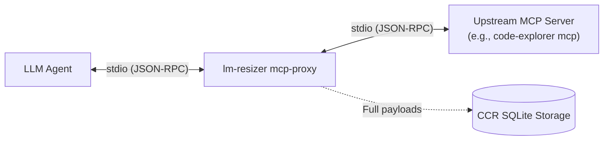

# Transparent MCP Proxy (`lm-resizer mcp-proxy`)

## Overview

Modern agentic coding workflows connect LLM agents to multiple MCP (Model Context Protocol) servers. For example, servers like [Code Explorer](https://github.com/coder/code-explorer) expose dozens of tools whose outputs are fed directly into the agent's context window. Without interception, raw verbose outputs quickly consume substantial portions of the context window.

`lm-resizer mcp-proxy` acts as a **transparent stdio proxy** positioned between the LLM client (e.g., Claude, Cursor, Codex, OpenCode) and upstream MCP servers:



## Usage & Configuration

To wrap an existing MCP server, prepend `lm-resizer mcp-proxy --` to the upstream command in your MCP configuration file (e.g. `.mcp.json` or Claude Desktop / Cursor settings).

### Example `.mcp.json`

```json
{
  "mcpServers": {
    "code-explorer": {
      "command": "lm-resizer",
      "args": [
        "mcp-proxy",
        "--",
        "code-explorer",
        "mcp"
      ]
    }
  }
}
```

Optional CLI flags:
- `--store-path <PATH>`: Custom path to CCR SQLite database (defaults to `~/.cache/lm-resizer/history.sqlite3`).
- `--no-ccr`: Disable CCR persistence and marker injection.

---

## Behavior Matrix: Treated vs. Untouched

To preserve 100% protocol fidelity and prevent agent hallucinations or schema degradation, `lm-resizer mcp-proxy` applies strict filtering rules:

| MCP Protocol Message | Proxy Behavior | Rationale |
| :--- | :--- | :--- |
| **`initialize` / `initialized`** | **Untouched** (100% verbatim) | Critical protocol handshake. Capabilities and protocol version negotiation must never be altered. |
| **`tools/list`** | **Untouched** (100% verbatim) | Tool definitions, schemas, and parameter descriptions. Altering schemas breaks tool-call generation by the LLM. |
| **`resources/*`, `prompts/*`** | **Untouched** (100% verbatim) | Metadata definitions; must match upstream capabilities. |
| **`tools/call` response (`text` content)** | **Compressed via Pipeline + CCR** | Tool execution results often contain verbose code, AST graphs, or search dumps. Candidates ≥ 512 bytes are compressed. |
| **`tools/call` response (`image`, `resource`, etc.)** | **Untouched** (100% verbatim) | Binary or structured non-text blocks are preserved verbatim without corruption. |
| **`tools/call` sub-512B / uncompressible text** | **Untouched** (100% verbatim) | Strict no-growth gate rejects candidates where `candidate.len() >= original.len()`. Original text is retained without marker. |
| **JSON-RPC Errors (`error` object)** | **Untouched** (100% verbatim) | Upstream error codes and diagnostic messages are forwarded verbatim to the client. |
| **Server Notifications & Pings** | **Untouched** (100% verbatim) | Logging notifications, progress reports, and ping heartbeats pass through immediately without delay. |
| **Upstream Crash / EOF** | **JSON-RPC Error `-32000`** | If the upstream process crashes while requests are pending, the proxy emits a well-formed JSON-RPC error response instead of hanging. |

---

## Content-Centric Retrieval (CCR) Integration

When a `text` block in a `tools/call` result is compressed:
1. The **exact, raw original payload** is written to the local CCR SQLite store (`lm-resizer` database).
2. The compressed text is appended with a retrieval hint:
   ```text
   [full output: <<ccr:f6888d28b8268ae79399df86>>]
   ```
3. If the agent needs the unabridged original output, it can retrieve it using the standard `lm-resizer retrieve` CLI or the `retrieve` tool:
   ```bash
   lm-resizer retrieve ccr:f6888d28b8268ae79399df86
   ```

---

## Real Measurements with `code-explorer mcp`

The following measurements were captured on a real local run wrapping `code-explorer mcp` against a Rust codebase:

| Request / Tool | Direct Size | Proxied Size | Savings | Compression Ratio / Note |
| :--- | :---: | :---: | :---: | :--- |
| **`initialize`** | 254 B | 254 B | 0 B (0.0%) | 100% byte-for-byte identical (untouched handshake) |
| **`tools/list`** | 17,206 B | 17,206 B | 0 B (0.0%) | 100% byte-for-byte identical (30 tool schemas preserved) |
| **`tools/call` (`context` for `run_mcp`)** | 1,134 B | 786 B | **348 B (30.7%)** | Text compressed; CCR token appended; raw payload recoverable |
| **`tools/call` (`list_repos`)** | 815 B | 656 B | **159 B (19.5%)** | Compacted repetition and whitespace |
| **`tools/call` (`query` for `compress`)** | 4,177 B | 4,177 B | 0 B (0.0%) | No-growth gate triggered: candidate size was not smaller than original, verbatim output preserved |

### Verification of CCR Retrieval
```bash
$ lm-resizer retrieve ccr:f6888d28b8268ae79399df86 | head -n 3
{
  "symbol": "run_mcp",
  "file": "src/main.rs"
...
```
The exact byte-accurate upstream payload was retrieved from CCR storage.

---

## Resilience & Fault Handling

- **Asynchronous Stdio Multiplexing**: Agent requests and upstream responses are handled on separate threads with synchronized pending request tracking. Out-of-order responses are mapped correctly by request `id`.
- **Graceful Termination**: On upstream server exit or EOF, any outstanding in-flight requests receive:
  ```json
  {"jsonrpc":"2.0","id":"<pending_id>","error":{"code":-32000,"message":"Upstream MCP server closed connection unexpectedly"}}
  ```
  This ensures the LLM client never hangs indefinitely waiting for a dead upstream child process.
- **Zero Python Runtime Surface**: Native Rust implementation with no external runtime dependencies.
