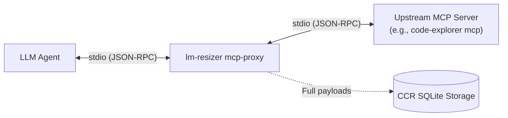

# Transparent MCP Proxy (`lm-resizer mcp-proxy`)

## Overview

Modern agentic coding workflows connect LLM agents to multiple MCP (Model Context Protocol) servers. For example, servers like [Code Explorer](https://github.com/phuetz/code-explorer) expose dozens of tools whose outputs are fed directly into the agent's context window. Without interception, raw verbose outputs quickly consume substantial portions of the context window.

`lm-resizer mcp-proxy` acts as a **transparent stdio proxy** positioned between the LLM client (e.g., Claude, Cursor, Codex, OpenCode) and upstream MCP servers:


```mermaid
flowchart LR
    Agent["LLM Agent"] <-->|"stdio (JSON-RPC)"| Proxy["lm-resizer mcp-proxy"]
    Proxy <-->|"stdio (JSON-RPC)"| Upstream["Upstream MCP Server\n(e.g., code-explorer mcp)"]
    Proxy -.->|"Full payloads"| CCR[("CCR SQLite Storage")]
```

## Usage & Configuration

To wrap an existing MCP server, prepend `lm-resizer mcp-proxy --` to the upstream command in your MCP configuration file (e.g. `.mcp.json` or Claude Desktop / Cursor settings).

### Example `.mcp.json`

```json
{
  "mcpServers": {
    "code-explorer": {
      "command": "lm-resizer",
      "args": [
        "mcp-proxy",
        "--",
        "code-explorer",
        "mcp"
      ]
    }
  }
}
```

Optional CLI flag (verified with `lm-resizer mcp-proxy --help`):
- `--store <PATH>`: custom path to the CCR SQLite database, shared with `retrieve`. Without it the proxy uses `$LM_RESIZER_STORE` when set, else `<state directory>/ccr.sqlite3`, where the state directory is `$LM_RESIZER_STATE_DIR`, else `lm-resizer/` under the first of `$LOCALAPPDATA`, `$XDG_STATE_HOME`, `$HOME`, `$USERPROFILE` (for example `$HOME/lm-resizer/ccr.sqlite3`). It is not `~/.cache/lm-resizer/history.sqlite3`.

There is no `--store-path` and no `--no-ccr` option: the proxy has no switch that disables CCR persistence. Anything written after `mcp-proxy` that is not `--store <PATH>` or `--help` is taken as the upstream command, so `mcp-proxy --no-ccr -- server` tries to launch a program called `--no-ccr`.

---

## Behavior Matrix: Treated vs. Untouched

To preserve 100% protocol fidelity and prevent agent hallucinations or schema degradation, `lm-resizer mcp-proxy` applies strict filtering rules:

| MCP Protocol Message | Proxy Behavior | Rationale |
| :--- | :--- | :--- |
| **`initialize` / `initialized`** | **Untouched** (100% verbatim) | Critical protocol handshake. Capabilities and protocol version negotiation must never be altered. |
| **`tools/list`** | **Untouched** (100% verbatim) | Tool definitions, schemas, and parameter descriptions. Altering schemas breaks tool-call generation by the LLM. |
| **`resources/*`, `prompts/*`** | **Untouched** (100% verbatim) | Metadata definitions; must match upstream capabilities. |
| **`tools/call` response (`text` content)** | **Compressed via Pipeline + CCR** | Tool execution results often contain verbose code, AST graphs, or search dumps. Candidates ≥ 512 bytes are compressed. |
| **`tools/call` response (`image`, `resource`, etc.)** | **Untouched** (100% verbatim) | Binary or structured non-text blocks are preserved verbatim without corruption. |
| **`tools/call` sub-512B / uncompressible text** | **Untouched** (100% verbatim) | Strict no-growth gate rejects candidates where `candidate.len() >= original.len()`. Original text is retained without marker. |
| **JSON-RPC Errors (`error` object)** | **Untouched** (100% verbatim) | Upstream error codes and diagnostic messages are forwarded verbatim to the client. |
| **Server Notifications & Pings** | **Untouched** (100% verbatim) | Logging notifications, progress reports, and ping heartbeats pass through immediately without delay. |
| **Upstream Crash / EOF** | **JSON-RPC Error `-32000`** | If the upstream process crashes while requests are pending, the proxy emits a well-formed JSON-RPC error response instead of hanging. |

---

## Content-Centric Retrieval (CCR) Integration

When a `text` block in a `tools/call` result is compressed:
1. The **exact, raw original payload** is written to the local CCR SQLite store (`lm-resizer` database).
2. The compressed text is appended with a retrieval hint:
   ```text
   [full output: <<ccr:f6888d28b8268ae79399df86>>]
   ```
3. If the agent needs the unabridged original output, it can retrieve it using the `lm-resizer retrieve` CLI, the `lm_resizer_retrieve` tool, or `GET /retrieve/<hash>`. The bare hash is the reference form. Exactly these displayed forms are also accepted: `ccr:<hash>`, `<<ccr:<hash>>>`, `[full output: <<ccr:<hash>>>]`, `hash=<hash>` and `hash=<hash>]`. A whole pasted view (several words or lines) is accepted only when it holds a single distinct key, for example a `compress` view that shows `hash=`. A view with no key (a log reduced to a template, with neither `hash=` nor `ccr:`) is refused. The `<<ccr:<12 hex>,<kind>,<size>>>` and `<<ccr:<12 hex> N_rows_offloaded>>` markers inside a compressed JSON view are reading aids, not keys, and are ignored (the key is the `hash=` shown with the view). Anything else is refused rather than guessed: an input holding several distinct keys fails with `ambiguous CCR reference`. The CLI prints the exact original text. The MCP tool and `GET /retrieve/<hash>` return a JSON object `{"hash","content"}` whose `content` is that text; the HTTP body is not the raw text.
   ```bash
   lm-resizer retrieve f6888d28b8268ae79399df86
   lm-resizer retrieve ccr:f6888d28b8268ae79399df86
   ```
   `lm-resizer retrieve` prints the exact original text that was stored, not a template or a compressed view. `GET /retrieve/<hash>` returns that text in the JSON field `content`.

---

## Checking retrieval locally

The hash above illustrates the marker syntax; replace it with the 24-character
hash actually returned by your run (the `ccr:` prefix and marker delimiters
are tolerated by `retrieve`).
Use the same store for compression and retrieval (`--store` for `retrieve` if
`mcp-proxy --store` selected a custom database). CCR expires after 30
minutes by default; export the retrieved text before expiry.

No versioned capture supports the former Code Explorer size comparison.
Those figures have been removed. To measure a run, save the direct and proxied
text and compare the retrieved bytes against the original before reporting savings.

---

## Resilience & Fault Handling

- **Asynchronous Stdio Multiplexing**: Agent requests and upstream responses are handled on separate threads with synchronized pending request tracking. Out-of-order responses are mapped correctly by request `id`.
- **Graceful Termination**: On upstream server exit or EOF, any outstanding in-flight requests receive:
  ```json
  {"jsonrpc":"2.0","id":"<pending_id>","error":{"code":-32000,"message":"Upstream MCP server closed connection unexpectedly"}}
  ```
  This ensures the LLM client never hangs indefinitely waiting for a dead upstream child process.
- **Zero Python Runtime Surface**: Native Rust implementation with no external runtime dependencies.
